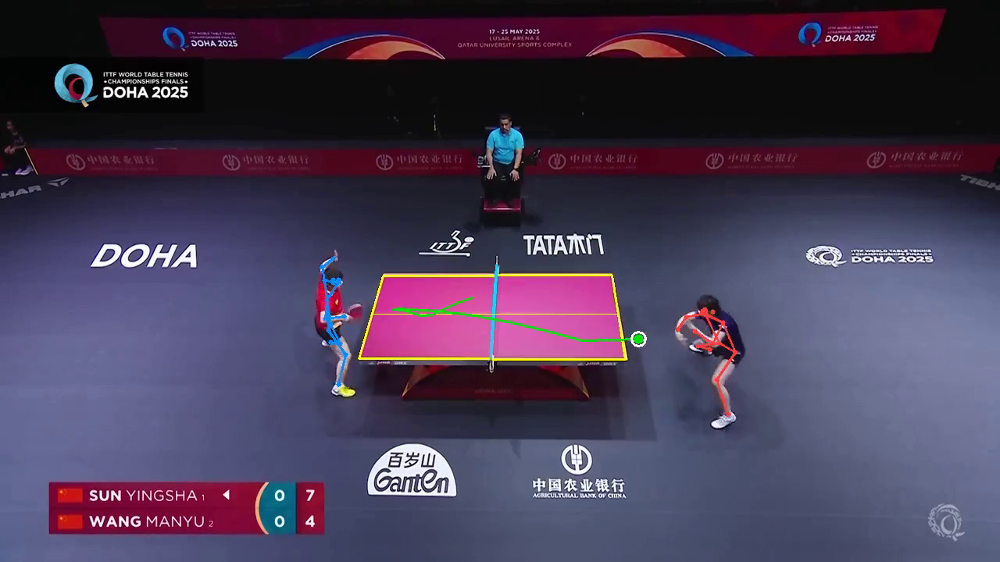
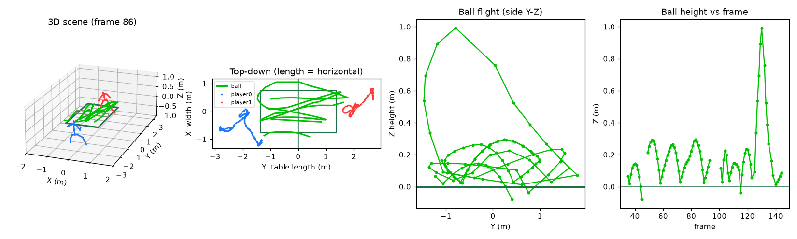

# rally3d

**3D table-tennis data from ordinary broadcast video.** rally3d is an end-to-end system that
turns full-match footage into synchronized, metric 3D training data — **ball trajectory**,
**player body pose**, and **table/camera geometry** — at dataset scale, from a single camera.



For every rally it reconstructs, rally3d produces (see [`docs/DATASET_SCHEMA.md`](docs/DATASET_SCHEMA.md)):

| Output | Contents |
| --- | --- |
| `camera.yaml` | Calibrated monocular camera (pose + focal), table = world origin |
| `ball_traj_2D.csv` | Per-frame ball detections with motion-blur cues (`Interp` flags bridged frames) |
| `ball_traj_3D.csv` | Metric 3D ball trajectory with bounces (`Interp` flags ray-filled frames) |
| `p0_3d.npy`, `p1_3d.npy` | Both players' 3D joints `(frames, 17, 3)`, world frame, metres |
| `table.json`, `meta.json` | Table geometry constants, provenance + quality metrics |

## How it works

```
WTT/ITTF broadcasts ─► match sourcing ─► rally segmentation ─► per-rally reconstruction ─► dataset
   (yt-dlp, budgeted)   (table-presence     (table │ body │ ball)      (manifest + card)
                         keyframe timeline)
```

1. **Sourcing** — bulk-downloads singles full matches with a **per-player footage budget**
   (default 5 h/player) so the dataset stays small and diverse.
2. **Rally segmentation** — a one-pass keyframe timeline classifies gameplay by table presence,
   with a **wide-shot filter** (mask size, border contact, width span) that rejects close-up
   replays; consecutive gameplay keyframes merge into rally clips.
3. **Table / camera** — the table's known geometry (2.74 × 1.525 m) calibrates the camera from
   segmentation-detected corners. A rectangle's corner correspondence is 90°-ambiguous, so
   rally3d adds a **physical disambiguation**: it re-solves the alternative assignment and keeps
   the camera that places both players behind opposite table ends (ankles ray-cast to the floor).
4. **Body** — mmcv-free 2D pose (RTMPose via `rtmlib`) with IoU tracking and player selection,
   MotionBERT 2D→3D lifting, then world-frame alignment by minimizing reprojection error at
   foot-contact frames.
5. **Ball** — blur-aware detection (BlurBall) tuned for high-speed play (low threshold, wide
   tracker gate), **quadratic bridging** of short 2D dropouts, physics-based 3D reconstruction,
   then a refinement chain: reprojection gating against the 2D track, physical speed caps,
   **ray-depth filling** of interior gaps (2D detection fixes the ray; depth interpolates
   smoothly), and parabola-preserving Savitzky–Golay smoothing per flight arc.
6. **Orchestration** — everything is resumable and quality-gated per rally; a manifest
   (`manifest.parquet` + `dataset_card.json`) aggregates the corpus. All synthetic points are
   flagged (`Interp`), so the data stays honest about measured vs inferred.

## Setup

Full machine-specific instructions in [`docs/SETUP.md`](docs/SETUP.md). In short:

```bash
python scripts/setup_env.py          # Python 3.12 venv + CUDA torch + deps + upstream patches
python scripts/download_weights.py   # table-seg, BlurBall, MotionBERT (RTMPose auto-downloads)
```

## Generating data

```bash
python scripts/run_bulk.py                        # download → segment → reconstruct → aggregate
# or stage by stage:
python scripts/download_videos.py --max-hours-per-player 5
python scripts/segment_rallies.py --videos data/videos --out data/rallies
python scripts/batch_generate.py  --rallies data/rallies --out data/dataset
python scripts/aggregate_dataset.py --dataset data/dataset
```

Inspect any rally visually (2D overlay with projected table, 3D scene animation, summary plots):

```bash
python scripts/render_rally.py --rally-dir data/dataset/rallies/<match>/<rally>
```



> ⚠️ **Footage is copyrighted.** Downloaded videos are private research inputs only — they are
> git-ignored and never redistributed. Only code and derived numeric annotations live here.

## Acknowledgements

rally3d was inspired by **TT3D** (Gossard, Ziegler & Zell, *TT3D: Table Tennis 3D
Reconstruction*, CVPR-W 2025) and builds on excellent open research components:
[TT3D](https://github.com/cogsys-tuebingen/tt3d) (table segmentation model, calibration
optimizer, ball physics solver), [BlurBall](https://github.com/cogsys-tuebingen/blurball)
(blur-aware ball detection), [MotionBERT](https://github.com/Walter0807/MotionBERT) (2D→3D
lifting), and [RTMPose](https://github.com/open-mmlab/mmpose/tree/main/projects/rtmpose)
(2D pose). Each retains its own license; see [`third_party/README.md`](third_party/README.md).

If you use the TT3D components, please cite:

```bibtex
@InProceedings{gossard2025,
  author    = {Gossard, Thomas and Ziegler, Andreas and Zell, Andreas},
  title     = {TT3D: Table Tennis 3D Reconstruction},
  booktitle = {Proceedings of the IEEE/CVF Conference on Computer Vision and Pattern Recognition (CVPR) Workshops},
  month     = {June},
  year      = {2025}
}
```
